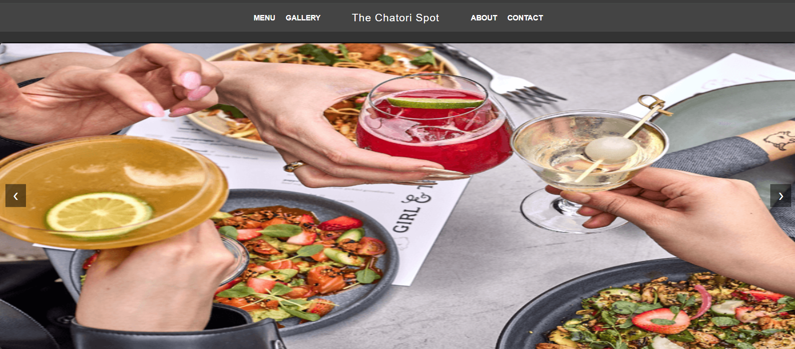

# 🍽️ MiniRestaurant Website

A beautiful, fully responsive MiniRestaurant website named The Chatori Spot built using pure HTML, CSS, and JavaScript. This project showcases multiple sections like Home, Menu, Gallery, About, and Contact — all organized in a scalable folder structure. It features smooth navigation, interactive elements, and visual content like food images, all tailored for a modern restaurant experience.


---
## 🚀 Live Demo

[](https://the-chatori-spot.netlify.app/)

🔗 **Visit Website**: [https://the-chatori-spot.netlify.app](https://the-chatori-spot.netlify.app/)

---

## 🔥 Features

- 🏠 Home Page with restaurant intro and hero image
- 📜 Menu Page displaying delicious items
- 🖼️ Gallery Page with image zoom and interaction
- 👨‍🍳 About Us section with styled content
- 📞 Contact Form for feedback or inquiries
- 🎨 Multiple CSS styles for different pages
- 📁 Organized folder structure for scalability


---

## 🛠️ Tech Stack

| Technology   | Purpose                        |
|--------------|--------------------------------|
| HTML5        | Structure of the webpages      |
| CSS3         | Styling & responsiveness       |
| JavaScript   | Interactivity & DOM operations |

---

## 📁 Folder Structure

```bash
📁 miniRestaurant/
├── index.html              # Home page
├── style.css               # Main styling for index
├── script.js               # JS for homepage interactivity
├── screenshot.png          # Preview screenshot for README
│
├── images/                 # All food and gallery images
│   └── ...many .jpg/.png files
│
├── other_pages/
│   ├── menu.html           # Menu page
│   ├── gallery.html        # Gallery page
│   ├── about.html          # About us page
│   ├── contact.html        # Contact page
│   ├── script2.js          # JS for gallery or other interactions
│   ├── style2.css          # CSS for gallery page
│   ├── style3.css          # CSS shared by about & contact
│   └── ... (additional supporting files)
│
└── README.md               # You're here!
```
## Note  
This project was inspired by an open-source restaurant website and has been customized, refactored, and enhanced for learning and portfolio purposes.

